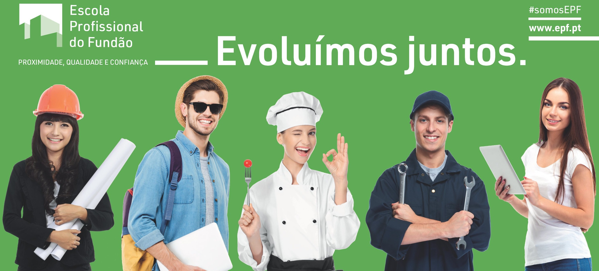

 

<h1 align="center"> Escola Profossional do Fundão</h1> 

<h2>Programador/a de Informática - 2 Ano</h2>

Bem-vindo ao 2º Ano de Programador/a de Informática da Escola Profissional do Fundão! Este é o ano em que vais consolidar os conhecimentos adquiridos e começar a explorar áreas mais avançadas e específicas da programação. Durante o 2º ano, os principais tópicos de estudo incluem:

 
  <li><mark>Programação Orientada a Objetos (POO):</mark> Vais aprender a organizar o código de forma mais eficiente e reutilizável através de conceitos como classes, objetos, herança e encapsulamento.</li>
  <li><mark>Bancos de Dados Relacionais e SQL:</mark> Introdução aos conceitos de bases de dados, como modelagem de dados e a linguagem SQL, que te permitirá criar, gerenciar e consultar bases de dados de forma eficiente.</li>
  <li><mark>Desenvolvimento Web (Backend):</mark> Neste ano, aprofundarás o desenvolvimento de aplicações web dinâmicas, introduzindo servidores, processamento de dados e interação com bases de dados.</li>
  <li><mark>APIs e Integração de Serviços:</mark> Começarás a trabalhar com APIs (Interfaces de Programação de Aplicações), aprendendo a integrar diferentes sistemas e serviços externos em teus projetos.</li>
  <li><mark>Estruturas de Dados e Algoritmos:</mark> A compreensão de como os dados são armazenados e manipulados é essencial para o desenvolvimento de software eficiente. Vais explorar estruturas como listas, pilhas, filas e árvores.</li>

Além das competências técnicas, o 2º ano também te encoraja a desenvolver:

 
  <li><mark>Testes Automatizados e Debugging:</mark> Aprenderás técnicas de teste de software para garantir que os teus programas funcionam corretamente e como depurar (debug) para encontrar e corrigir erros.</li>
  <li><mark>Segurança Básica em Aplicações:</mark> Começarás a entender os princípios de segurança em desenvolvimento de software, protegendo dados sensíveis e evitando vulnerabilidades comuns.</li>
  <li><mark>Gestão de Projetos:</mark> Vais participar em projetos mais complexos, aprendendo a organizar tarefas, gerir tempo e colaborar de forma eficaz com uma equipe.</li>

Este é o ano para te envolveres ativamente em projetos práticos, compartilhar os teus avanços no GitHub e começar a construir um portfólio de trabalho. Este espaço serve para trocas de conhecimento, dúvidas e para continuar o teu desenvolvimento.

  Feito com amor por <a href="https://www.epfundao.edu.pt/" target="_blank" style="color: #69BF6D">@EPFundão</a>. 💚  
  

